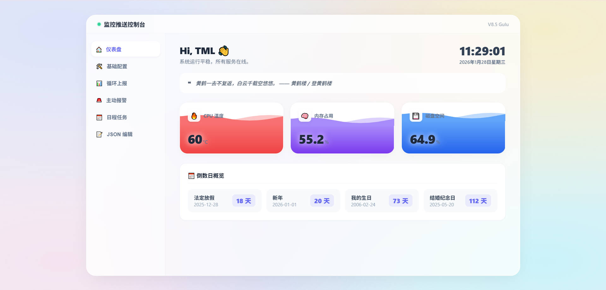
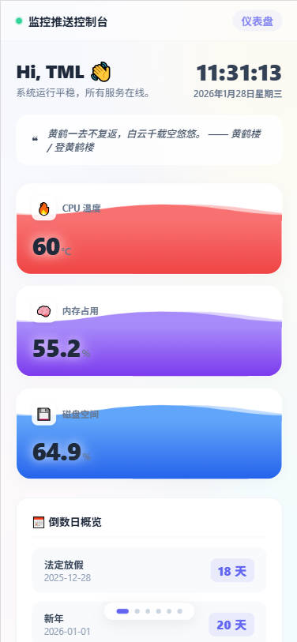

# ⚡ OmniMonitor - 全能监控推送控制台

一个运行在 **Linux / 嵌入式设备** 上的轻量级服务器监控与生活助手，  
具备 **高颜值 Web 仪表盘** + **微信推送能力**。

---

## 📖 项目简介

**OmniMonitor** 是一个模块化的 Python 服务，专为资源受限设备设计，例如：

- 海思机顶盒
- 树莓派
- 云服务器 / 旁路由

它不仅可以监控 **CPU / 内存 / 磁盘 / 温度** 等系统状态，还能整合：

- 天气
- 金价
- B 站 UP 主动态
- 倒数日 / 纪念日

并通过 **PushPlus 推送到微信**，或在 **Web 控制台** 中实时查看。

---

## ✨ 核心功能

### 🖥️ 极简主义 Web 控制台（v7.7）

- **Liquid Capsule UI**  
  拟物化水波纹胶囊仪表，展示 CPU / 内存 / 磁盘负载

- **Glassmorphism 风格**  
  全局毛玻璃磨砂质感，丝滑 CSS3 动画

- **Dashboard 面板**
  - 实时时钟
  - 每日一言
  - 倒数日概览
  - 粒子点击特效

- **可视化配置**
  - 在线热修改配置
  - Key 隐私保护（隐藏 / 显示）
  - 无需重启服务

---

### 🚨 全方位监控与报警

#### 硬件监控
- 常规 Linux 系统
- 海思（HiSilicon）特殊芯片温度读取

#### 主动报警
- CPU 温度过高
- 磁盘占用过高
- 黄金价格越界（低吸 / 高抛提醒）
- 恶劣天气预警（雨 / 雪 / 雾）
- B 站 UP 主更新提醒（封面 + 跳转链接）

---

### 📅 生活助手

- **通勤日报**
  - 早安 / 下班路况推送
  - 高德地图 API
  - 驾车 / 公交 / 骑行对比

- **倒数日**
  - 支持公历 / 农历
  - 精准计算
  - 纪念日自动提醒

- **循环上报**
  - 整点 / 定时推送
  - 系统状态 + 环境信息

---

## 🏗️ 系统架构

项目采用 **完全解耦的 OOP 架构设计**：

Project_Root/
 ├── main.py                # [入口] 服务启动与模块组装
 ├── scheduler.py           # [调度] 核心业务逻辑与时间轮询
 ├── web_service.py         # [Web]  HTTP 服务与 API 接口
 ├── web_template.py        # [UI]   HTML / CSS / JS 静态资源
 ├── monitor.py             # [硬件] 硬件数据采集与历史记录
 ├── data_fetcher.py        # [数据] 外部 API 请求封装
 ├── push_client.py         # [推送] PushPlus 客户端
 ├── config_manager.py      # [配置] 配置热重载与原子写入
 └── utils.py               # [工具] 农历计算与辅助函数

---

## 🚀 快速开始

### 1️⃣ 环境要求

- Python 3.x
- 依赖库：`zhdate`（用于农历转换）

```bash
pip install zhdate
```

### 2️⃣ 配置

首次运行会自动生成 `config.json`，也可手动创建。
 推荐通过 Web 控制台进行配置：

```
http://<设备IP>:8888
```

需要配置内容：

- **PushPlus Token**（微信消息推送）
- **API Keys**
  - 高德地图（Web 服务）
  - 和风天气
- **阈值**
  - 温度
  - 金价区间

------

### 3️⃣ 运行

```
python3 main.py
```

推荐后台运行：

```
nohup python3 main.py > monitor.log 2>&1 &
```

------

## 📸 界面预览

> 
>
> 
>
> 

------

## 📝 更新日志

### v7.7（Latest）

- **UI 重构**
  - 引入 Liquid Capsule 水波纹仪表盘
- **交互升级**
  - 粒子点击特效
  - 移动端 / 宽屏适配优化
- **精度提升**
  - 倒数日逻辑移至后端
  - 修复农历计算问题
- **安全增强**
  - 配置文件 Token 支持隐藏 / 显示切换